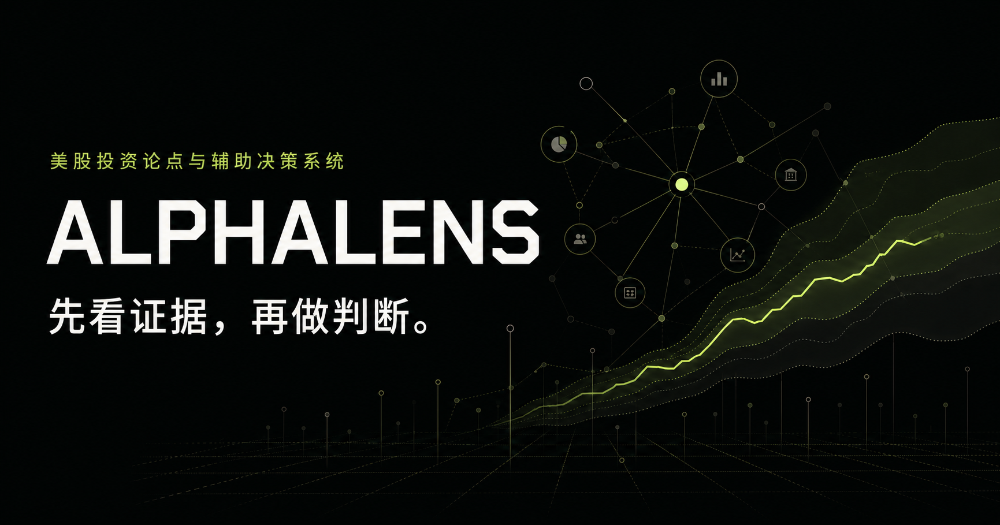

# AlphaLens

Evidence first. Decisions second.

[](https://github.com/axlezhao/AlphaLens/actions/workflows/ci.yml)
[](LICENSE)

[中文文档](README.zh-CN.md) · [Product architecture plan](docs/PRODUCT_ARCHITECTURE_PLAN.md) · [Roadmap](docs/CAPABILITIES_AND_ROADMAP.md) · [Development](docs/DEVELOPMENT.md) · [Architecture](docs/ARCHITECTURE_AND_WORKFLOW.md)

AlphaLens is a personal, open-source research workbench for US equities. It explores how source-backed evidence, falsifiable investment theses, valuation scenarios, and portfolio risk can fit into one reviewable workflow. It does **not** place trades.

Originally built as a competition prototype, AlphaLens is now maintained by [axlezhao](https://github.com/axlezhao) as an independent project. WorkBuddy instructions are an optional integration experiment, not a requirement for developing the web application.

## Project status

**Experimental beta — `0.5.0-beta`, not production-ready.** The repository contains a working interface, domain services, provider adapters, and deterministic calculations. Breadth of implementation is not the same as end-to-end validation.

- The landing research desk and thesis cards contain illustrative data, now visibly labelled as samples. A completed research job opens a separate result view with that job's actual provider snapshot, source URL, `as_of`, fetched time, freshness, missing capabilities and warnings; it does not replace the sample thesis cards or generate a thesis.
- Research jobs collect provider snapshots. They do **not** currently call an external LLM or automatically produce a source-grounded investment thesis.
- Multi-agent arbitration and quality scores are heuristic scaffolding, not calibrated investment confidence or a validated autonomous analyst system.
- A fresh clone can run a loopback-only, fixture-backed D1 workflow with a synthetic `.invalid` development identity. It is not a self-contained multi-user backend or a production authentication setup.

[Hosted preview](https://alphalens-investment-os.tracyaxle.chatgpt.site) — existing deployment; access may require authentication or owner approval. Public source code does not imply public access to the hosted workspace. Deployment access is unchanged.



## What is in the repository?

| Area | Implemented foundation | Important boundary |
| --- | --- | --- |
| Data and evidence | SEC EDGAR, approved issuer IR feeds, Alpha Vantage adapters; caching, retries, freshness metadata | Credentials, provider permissions, and data availability are deployment-dependent; per-instance SEC throttling is not a global rate limit |
| Research jobs | D1-backed queue, idempotency, events, versioned evidence and snapshots; actual result/provenance view | Snapshot collection, not automated thesis generation; historical `as_of` does not guarantee point-in-time source retrieval |
| Personal workbench | Watchlists, thesis versions, falsifiers, earnings job types, export and notification adapters | Backend/auth configuration required; delivery and external integrations need live validation |
| Portfolio tools | Exposure, concentration, imported-return correlation, scenario stress and action conditions | Results depend on user inputs and simplified models; no brokerage or execution integration |
| Platform experiments | Workflow definitions, KPI/skill registries, review/publish APIs, scoped API keys and webhook outbox | Workflow lifecycle, skill isolation, failover, security and end-to-end coverage need hardening |

See the [capability inventory and acceptance criteria](docs/CAPABILITIES_AND_ROADMAP.md) for what is implemented, what remains unverified, and what comes next.

The [independent-platform architecture plan](docs/PRODUCT_ARCHITECTURE_PLAN.md) defines the proposed DeepSeek BYOK gateway, evidence-to-artifact workflow, MCP boundary, security model and phased delivery gates. It is a plan, not implemented functionality.

## Quick start: interface and development

Use Node.js 24 (`.nvmrc`) and pnpm **11.9.0**, pinned in `package.json`.

```bash
git clone https://github.com/axlezhao/AlphaLens.git
cd AlphaLens
nvm use                     # optional, if you use nvm
npm install --global pnpm@11.9.0
pnpm install --frozen-lockfile
cp .env.example .env.local
pnpm dev
```

Open the local URL printed by the development server. The sample interface can be explored without paid market-data credentials. Authenticated research, persistence, and scheduled tasks need additional infrastructure; see [development boundaries](docs/DEVELOPMENT.md) and the [operations guide](docs/BETA_OPERATIONS_AND_DATA_GOVERNANCE.md). Do not use the example contact email for SEC requests.

For a reproducible local database and research workflow with **synthetic data only**, use the [local fixture workflow](docs/LOCAL_FIXTURE_WORKFLOW.md):

```bash
cp .dev.vars.example .dev.vars
pnpm db:local:migrate
pnpm local:verify:e2e
```

This command starts a loopback-only server temporarily, creates/executes/queries/cancels fixture research jobs, then stops it. It does not call external Providers or require any market-data, model or production credentials.

## Verify a change

```bash
pnpm run lint
pnpm run typecheck
pnpm test
```

Tests cover deterministic finance helpers, provider contracts, source conflict/time checks, portfolio/platform helpers, and built-worker server rendering. They do not establish real-provider availability, tenant security, research accuracy, or investment performance. CI runs these checks without live provider keys.

## Architecture

The current data path is:

```text
Web UI → authenticated API → D1 research queue → provider adapters
                                              → source/evidence snapshots
                                              → job status / event API
```

The intended research loop is evidence → thesis → challenge → valuation → falsifier → review. Connecting the snapshot result to that complete loop is the next priority, not a completed feature.

The application uses **TypeScript**, React/Next.js through Vinext/Vite, and Cloudflare Workers/D1. TypeScript/JavaScript is not Java. Python analytics can be introduced behind a clear interface if needed; a backend rewrite is not a prerequisite for making the current workflow reliable.

```text
app/                 Web interface and API routes
db/ + drizzle/       Schema and versioned D1 migrations
lib/providers/       SEC, issuer IR, licensed market/consensus adapters
lib/research/        Job queue, snapshot runner, evidence persistence
lib/workbench/       Personal research, exports, notifications
lib/portfolio/       Deterministic exposure and risk calculations
lib/platform/        Experimental workflows, routing, review and webhooks
tests/               Automated checks
docs/                Architecture, operations, roadmap and release notes
workbuddy-skill/     Optional workflow instruction bundle
```

## Next milestone

1. Add end-to-end tenant/job tests and harden workflow recovery, outbound requests and deletion.
2. Extend the result view into a reviewable evidence artifact with citation spans and explicit human review.
3. Introduce a model adapter and measured research evaluation only after the evidence path is trustworthy.

[Public issue tracker](https://github.com/axlezhao/AlphaLens/issues) · [Detailed roadmap](docs/CAPABILITIES_AND_ROADMAP.md) · [Changelog](CHANGELOG.md)

## Contributing and security

Small, testable contributions are welcome. Read [CONTRIBUTING.md](CONTRIBUTING.md), the [Code of Conduct](CODE_OF_CONDUCT.md), and [SECURITY.md](SECURITY.md). Please open an issue before a major architecture change, and do not commit personal portfolios, provider responses with restricted rights, tokens, or private workspace data.

## License and data

The project code is licensed under [MIT](LICENSE). Third-party dependencies, provider data, trademarks, and external documents retain their own terms. The code license does not grant market-data redistribution rights. Bring your own authorized credentials and verify permitted use before enabling an integration.

AlphaLens is research software, not investment advice. Outputs and example numbers may be incomplete or wrong; independently verify sources, timestamps, assumptions, and calculations. No automatic order execution is implemented or planned for this project.
