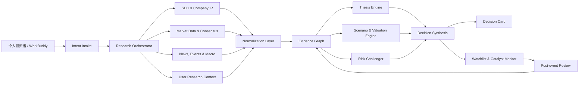
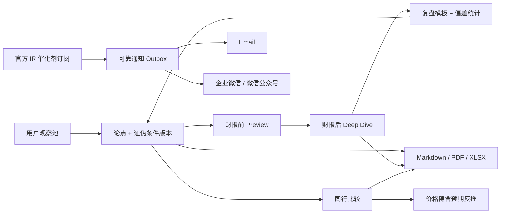
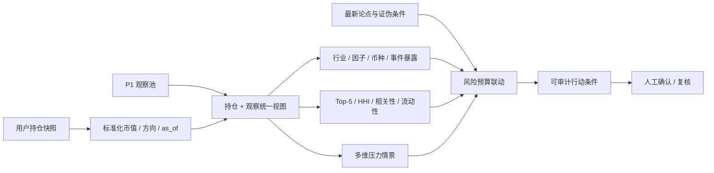
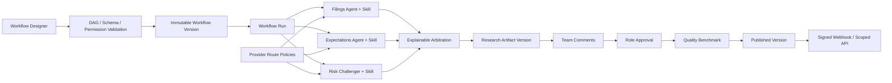

# AlphaLens 架构链路、Workflow 与思维逻辑

> 阅读边界（`0.5.0-beta`）：本文同时保留长期设计与已实现模块，不是完成度证明。AlphaLens 已转为独立个人开源项目；以[能力与路线图](CAPABILITIES_AND_ROADMAP.md)作为当前状态的统一入口。
>
> 当前实际研究链路为 Web UI → 可信认证 API → D1 队列 → Provider 数据快照 → 查询/事件 API → 真实来源结果页。结果页展示任务实际 snapshot 的 URL、抓取时间、`as_of`、缓存、新鲜/陈旧、缺失能力与警告；首页示例论点不会被包装为本次任务产物。runner 不调用外部 LLM。下文 Thesis Engine、独立 Agent 分析、完整发布/审批 DAG、新闻/宏观源等属于目标设计或不完整实验；评分为启发式，Skill 权限声明不是安全沙箱，fallback 列表不等于已执行跨供应商切换。保存 `as_of` 也不保证历史可得性。
>
> 本地开发另有隔离分支：`loopback fixture identity → local D1 → synthetic Provider snapshots → result view`。它必须同时启用本地与 fixture 开关、接收 loopback 请求并使用 `.invalid` 身份；fixture 来源明确标为合成数据，绝不访问真实 Provider。详见[本地 Fixture 工作流](LOCAL_FIXTURE_WORKFLOW.md)。

维护原则：模块完成后更新本文相关说明、README 和路线图，并记录可复现验收；不再用“比赛展示可跑通”作为生产就绪标准。

## 1. 产品目标

AlphaLens 的目标不是“告诉用户买什么”，而是把公开市场研究中的关键判断过程产品化：

```text
研究问题
  → 可靠来源
  → 结构化证据
  → 正反投资论点
  → 情景与估值
  → 证伪条件
  → 观察与复核
  → 决策复盘
```

系统输出的是“研究是否充分、假设是什么、什么会证明判断错误”，而不是未经解释的买卖分数。

## 2. 端到端链路



P1 把单次研究链路扩展成持续工作台：



每一次 P1 写入都携带 `workspace_id` 与 `as_of`；论点和证伪条件追加新版本，不覆盖历史。财报工作流复用 ResearchJob 队列；催化剂与通知由独立内部 Worker 刷新和投递，失败保留可重试状态。

## 3. 系统分层

### 3.1 交互层

入口包括：

- AlphaLens Web 工作台；
- WorkBuddy 对话和自定义 Skill；
- 未来的移动端或 IM Bot；
- API 客户端。

交互层只负责接收研究问题、展示结果和收集用户反馈，不直接实现数据抓取或估值逻辑。

### 3.2 Research Orchestrator

Orchestrator 是工作流控制器，负责：

1. 识别证券代码、交易所、研究问题和研究期限；
2. 确定需要哪些来源和分析模块；
3. 并行触发数据获取；
4. 管理任务状态、重试、超时和降级；
5. 合并结果并触发反方审查；
6. 生成最终研究产物。

它不应该自己“编造答案”，而是调度具备明确输入输出契约的模块。

### 3.3 数据源与 Adapter

建议按语义类别隔离数据源：

| 类别 | 主要内容 | 优先级 |
|---|---|---:|
| SEC / Company IR | 10-K、10-Q、8-K、财报、电话会、投资者演示 | 最高 |
| Market Data | 价格、市值、股本、历史行情、估值指标 | 高 |
| Consensus | 市场一致预期、目标价、盈利修正 | 高 |
| Events / News | 公司事件、行业事件、新闻线索 | 中 |
| Macro | 利率、通胀、汇率、商品与经济数据 | 按场景 |
| User Context | 用户论点、观察池、研究笔记 | 辅助 |

所有第三方 Provider 都通过 Adapter 映射到统一领域契约。前端和 Thesis Engine 不感知具体供应商，便于替换数据源、处理许可证差异和实现多供应商容灾。

### 3.4 Normalization Layer

原始数据不能直接进入投资判断，需要完成：

- 证券代码、公司实体和交易所对齐；
- 财年、自然年、季度和 TTM 期间统一；
- 单位、币种和拆股调整；
- GAAP 与 Non-GAAP 指标隔离；
- 同名 KPI 的定义核对；
- 来源冲突和数据缺失标记；
- `as_of` 与 `observed_at` 时间保存。

禁止在口径冲突时静默取平均或覆盖。

### 3.5 Evidence Graph

Evidence Graph 是 AlphaLens 的核心数据模型。每个证据节点至少包含：

```text
evidence_id
security_id
kind
claim
source_ids
observed_at
confidence
supports_thesis
expires_at (optional)
```

证据分类：

- `FACT`：可在权威来源中直接验证的事实；
- `EXPECTATION`：市场一致预期或当前价格隐含预期；
- `INFERENCE`：由模型或 Agent 推导的结论；
- `USER_VIEW`：用户自己的判断；
- `UNVERIFIED`：尚未完成核验的线索。

把事实和推断分开，是降低金融 Agent 幻觉和过度自信的第一道防线。

### 3.6 Thesis Engine

Thesis Engine 不生成单向故事，而是输出：

- 核心分歧；
- 支持论点；
- 反对论点；
- 尚未知的信息；
- 催化剂；
- 证伪条件；
- 当前确信度与变化原因；
- 下一次复核触发器。

论点状态建议使用：

```text
draft → active → weakening → invalidated → closed
```

每次更新创建新版本，不直接覆盖历史，从而支持事后复盘。

### 3.7 Scenario & Valuation Engine

情景估值服务回答三个问题：

1. Bear/Base/Bull 分别依赖哪些业务假设；
2. 当前价格已经隐含怎样的增长和利润率；
3. 哪些输入对目标价格最敏感。

MVP 可以使用驱动因子模型：

```text
Revenue = Market Size × Market Share
Operating Profit = Revenue × Operating Margin
Equity Value = Forecast Earnings × Valuation Multiple
Target Price = Equity Value ÷ Diluted Shares
```

未来可按行业切换 DCF、SOTP、EV/Revenue、P/E、P/B 或单位经济模型。估值输出必须保留假设、单位、日期和模型版本。

### 3.8 Risk Challenger

Risk Challenger 必须独立于主论点执行，检查：

- 是否只选择支持用户观点的证据；
- 是否把相关性当成因果；
- 是否忽略市场一致预期；
- 是否混用估值口径或财务期间；
- 是否过度依赖单一来源；
- 论点是否真的可证伪；
- 是否遗漏流动性、政策、竞争和事件风险。

Risk Challenger 不能简单生成一段泛化风险提示，而要指出具体薄弱假设和需要补充的证据。

### 3.9 Decision Synthesis

最终 Decision Card 包含：

- 证券、价格时间戳和研究问题；
- 核心分歧和论点状态；
- 支持、反对和待验证证据；
- Bear/Base/Bull 假设与估值区间；
- 当前价格隐含预期；
- 催化剂和证伪条件；
- 数据缺口、来源健康度和置信度；
- 下一次复核时间。

系统可输出“研究不足”“等待验证”或“论点失效”，不强迫给出方向性结论。

## 4. 核心 Workflow

### Step 1：INTAKE

输入：ticker、研究问题、时间范围、已有观点。

检查：

- ticker 是否唯一映射到证券；
- 研究目标是公司研究、财报、估值还是事件分析；
- 需要实时数据还是历史快照；
- 用户是否已经持有明确观点，需要防止确认偏误。

### Step 2：SOURCE

先获取拥有事实定义权的来源，再补充市场与媒体信息。原则是“最小充分来源”，不是无边界搜索。

### Step 3：NORMALIZE

将数据映射到统一期间、单位和指标定义，输出冲突、缺失和陈旧性标记。

### Step 4：EVIDENCE

把材料拆成可引用的证据节点，并连接到来源节点、证券节点和指标节点。

### Step 5：THESIS

形成核心分歧、正反论点、未知项和证伪条件。每条主要论点都必须能回到 Evidence Graph。

### Step 6：SCENARIO

建立 Bear/Base/Bull，计算当前价格隐含预期和敏感性，不把目标价伪装成确定性预测。

### Step 7：CHALLENGE

使用独立反方流程检查证据选择、逻辑跳跃、口径错误和遗漏风险；必要时降低置信度或退回补充研究。

### Step 8：PERSIST & MONITOR

保存研究版本、稳定 ID、催化剂和下一次复核条件。新财报或新事件发生时只更新受影响的证据与论点，而不是每次从零生成。

### Step 9：REVIEW

对照当时的假设和实际结果，区分：

- 数据错误；
- 模型错误；
- 逻辑错误；
- 时点错误；
- 价格已经反映但方向判断正确；
- 纯粹不可预测事件。

复盘结果进入用户研究画像，但不用于生成未经解释的“个人荐股模型”。

## 5. 思维逻辑

AlphaLens 的判断顺序是：

### 5.1 先问市场分歧，而不是先问涨跌

好的研究问题通常是“市场低估或高估了什么”，而不是“这只股票会不会涨”。

### 5.2 先验证事实，再解释事实

Agent 先保存权威事实，再做归因和推断。推断必须显式标记，并允许被后续证据推翻。

### 5.3 同时构建多头和空头最强论证

不是生成若干泛化风险，而是尽可能强化双方最有力的论证，然后判断分歧落在哪个可观测指标上。

### 5.4 将观点翻译成可观测指标

例如“AI 需求持续”需要翻译为数据中心收入、订单、供给、毛利率和客户资本开支等指标，否则无法跟踪或证伪。

### 5.5 反推价格隐含预期

估值不是给出一个看似精确的目标价，而是比较：

```text
市场隐含假设 vs. AlphaLens 基础假设
```

只有两者存在可解释差异时，才形成真正的投资分歧。

### 5.6 用证伪条件控制叙事漂移

如果没有事先定义证伪条件，投资者容易在事实变化后不断修改故事。系统因此要求在建立论点时同步写出判错规则。

### 5.7 输出行动条件，而不是行动命令

系统输出应该是：继续研究、等待验证、加入观察池、论点弱化或论点失效。仓位和交易决策需要结合用户自身约束，并且不由当前 Demo 自动执行。

### 5.8 P2 组合辅助决策链路



组合层的思维顺序是：先确认 NAV、持仓方向、价格时间与数据状态；再区分 intended alpha 与 unintended exposure；随后检查集中度、相关性、流动性和事件簇；最后把压力损失与最新论点/证伪条件合并。情景损失预算是提前约定的复核阈值，`absoluteLossCapBps` 是更高优先级的硬性告警，两者不能混称。

压力引擎对 Long/Short 使用带符号市值，支持 ticker、sector、factor、currency 和 event 冲击；Factor 冲击按用户提供的敏感度缩放。缺失 NAV 时以绝对持仓市值合计作为临时分母并显示警告；缺失 ADV、价格或相关性样本时不填造数字。`risk.refresh` 使用输入哈希保存不可变风险快照和幂等行动条件。

行动条件只包含触发器、谓词、严重度、解释和确认状态；数据模型与 API 均不存在券商订单、交易数量、路由或执行字段。

### 5.9 P3 研究平台化链路（目标流程，部分实现）



Workflow 定义是有向无环图，节点限制、依赖存在性、循环和仲裁节点数量在发布前校验。每次运行固化 Workflow、Skill、模型、Prompt、`as_of` 与 trace；角色节点进入研究快照队列，不代表独立模型调用。审批后恢复、发布节点、并发上限和部分失败终态尚需完善。Skill 安装和 Manifest 权限校验约束指令注入，但没有实现隔离不可信工具的运行时沙箱。

Provider 不是硬编码“谁先返回用谁”，而是先按 capability、allowed use、健康/熔断状态、新鲜度、延迟和成本预算过滤，再给出 selected、fallback、rejected 与解释。SEC 仍是 filings 的必需权威来源；没有合法行情/一致预期授权时对应节点明确降级。

当前 runner 执行 selected Provider；fallback 只是候选元数据，并未实现跨供应商失败重试。

仲裁模块按传入的证据覆盖、来源权威、反证处理、新鲜度与推理清晰度指标评分，保存胜出者、解释和少数意见；当前候选来自角色化快照及启发式指标，而非已经验证的独立分析。平台 UI 的 Benchmark 还包含示例指标，分数不是经校准的研究可信度或投资概率。研究版本发布 API 有评论/角色审批门禁，发布事件进入幂等 Webhook Outbox；这不代表整条自动发布 DAG 已跑通。

开放 API Key 只保存 SHA-256 摘要和前缀，按 scope 授权；Webhook 密钥加密保存，投递使用 `t=<unix>,v1=<HMAC-SHA256>` 签名、幂等 ID、指数退避与死信。已有 URL 校验不能视为完整 SSRF 防护：IPv6、DNS/rebinding 与实际连接地址验证仍需加固；Outbox 发送中断恢复也需端到端验证。

## 6. 错误处理与降级

| 场景 | 系统行为 |
|---|---|
| 实时价格不可用 | 使用最近快照并显著显示时间，不计算伪实时结论 |
| 权威来源与数据商冲突 | 保留双方数值和口径，标记冲突并降低置信度 |
| 新闻无法回到原始公告 | 标记为 `UNVERIFIED`，不作为关键结论唯一依据 |
| 一致预期不可用 | 省略预期比较，不使用媒体转述替代 |
| 研究证据不足 | 输出“研究不足”和具体缺口，不强行给结论 |
| Provider 超时 | 重试、熔断并回退缓存快照，记录来源健康状态 |

## 7. 可观测性与审计

每个研究任务应保存：

- `request_id`；
- `trace_id`；
- `as_of`；
- 输入问题与解析结果；
- 调用的数据源和耗时；
- 数据快照版本；
- 模型与 Prompt 版本；
- 论点版本和变更原因；
- 错误、重试与降级记录。

这使系统能够回答“当时基于哪些数据得出这个判断”，而不仅是返回最终文本。

## 8. 安全与合规边界

- 密钥通过服务端环境变量或凭据注入管理；
- 第三方金融数据必须在授权范围内使用；
- 用户数据需要身份隔离、最小权限和审计日志；
- 不自动执行证券交易；
- 不使用收益承诺或确定性预测语言；
- 对外展示必须包含研究用途声明和数据截至时间；
- 正式商用前需要完成适用司法辖区的法律与合规审查。

## 9. 当前代码映射

| 设计模块 | 当前实现 |
|---|---|
| Web 工作台 | `app/page.tsx` |
| P1 个人研究工作台 | `app/workbench.tsx` |
| P2 组合辅助决策 | `app/portfolio.tsx` |
| P3 研究平台控制面 | `app/platform.tsx` |
| 研究任务 API | `app/api/v1/research/route.ts` |
| P1 查询与命令 API | `app/api/v1/workbench/route.ts` |
| P2 组合查询与命令 API | `app/api/v1/portfolio/route.ts` |
| P3 平台查询与命令 API | `app/api/v1/platform/route.ts` |
| Scoped Open API | `app/api/open/v1/research/route.ts` |
| Workflow/Webhook Worker | `app/api/internal/platform-worker/route.ts` |
| 隐含预期 API | `app/api/v1/implied-expectations/route.ts` |
| 报告导出 API | `app/api/v1/reports/[ticker]/route.ts` |
| 催化剂/通知 Worker | `app/api/internal/workbench-worker/route.ts` |
| 健康检查 | `app/api/health/route.ts` |
| 领域契约 | `lib/research/contracts.ts` |
| Demo Provider | `lib/research/demo-adapter.ts` |
| P1 领域服务 | `lib/workbench/service.ts` |
| P2 组合服务 | `lib/portfolio/service.ts` |
| P3 平台服务与编排 | `lib/platform/service.ts`、`lib/platform/orchestrator.ts` |
| Provider 路由与仲裁 | `lib/platform/provider-routing.ts`、`lib/platform/analytics.ts` |
| API Key 与 Webhook | `lib/platform/api-auth.ts`、`lib/platform/webhooks.ts` |
| 暴露、相关性、压力与行动条件 | `lib/portfolio/analytics.ts` |
| 提醒连接器与可靠 Outbox | `lib/workbench/connectors.ts` |
| 隐含预期和偏差统计 | `lib/workbench/analytics.ts` |
| Markdown/PDF/XLSX 生成 | `lib/workbench/exports.ts` |
| WorkBuddy Workflow | `workbuddy-skill/SKILL.md` |
| Skill Manifest | `workbuddy-skill/skill.yml` |
| 服务端渲染测试 | `tests/rendered-html.test.mjs` |
| 组合风险回归测试 | `tests/portfolio.test.ts` |
| 平台治理回归测试 | `tests/platform.test.ts` |
