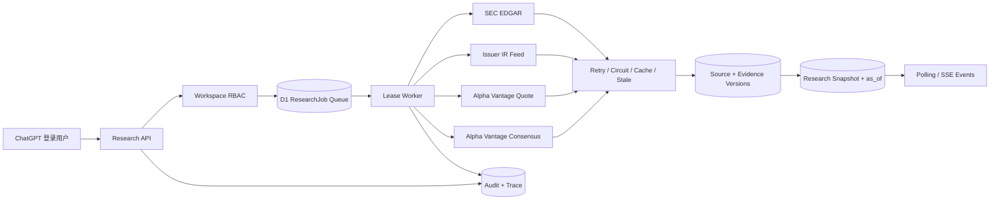

# AlphaLens Beta：运行链路、数据治理与上线手册

## 1. Beta 运行链路



创建任务写入 D1 后立即返回 `202`，并通过 Cloudflare `waitUntil` 启动后台消费者。内部 Worker 通过条件更新获取 90 秒租约，执行时增加 `attempts`；Worker 丢失或超过后台执行窗口后，受保护的恢复 Worker 会回收租约。任务支持指数退避、三次尝试、十分钟超时、取消标记、轮询和 SSE 增量事件。

P1 工作台复用相同租户与任务基础设施。财报 Preview / Deep Dive 创建 ResearchJob；催化剂订阅由 `workbench-worker` 按 `next_refresh_at` 拉取官方 IR；提醒先进入幂等 Outbox，再由邮件、企业微信或微信公众号 Adapter 投递。连接器目标使用 AES-GCM 加密保存，列表接口只返回脱敏提示。

## 2. 数据来源与授权边界

| 数据 | 实现 | Beta 边界 | 默认新鲜度 |
|---|---|---|---:|
| SEC 申报与 XBRL | `data.sec.gov` submissions/companyfacts | 公开信息；必须引用 SEC；不得暗示 SEC 背书 | 6 小时 |
| 公司 IR | 证券记录中显式配置的 HTTPS RSS/Atom | 只允许与已批准 IR Base URL 同域；保存链接和必要摘录 | 6 小时 |
| 行情 | Alpha Vantage `GLOBAL_QUOTE` | BYO 合法授权；服务端展示；禁止原始数据再分发 | 15 分钟 |
| 一致预期 | Alpha Vantage `EARNINGS_ESTIMATES` | BYO 合法授权；明确标为 `EXPECTATION`，不得当作公司事实 | 12 小时 |

Alpha Vantage 当前公开条款把超出个人用途的投资分析、研究、测试和监控列入商业使用。本项目因此同时要求 `ALPHA_VANTAGE_API_KEY` 和 `ALPHA_VANTAGE_LICENSE_ACK=commercial-or-authorized`；没有相应协议时 Provider 保持 `disabled`。实时/延时行情还受交易所权利约束，不能因为 API 技术上可调用就假设拥有展示或再分发权。

依据：

- [SEC EDGAR 限速公告](https://www.sec.gov/filergroup/announcements-old/new-rate-control-limits)
- [SEC Internet Security Policy](https://www.sec.gov/about/privacy-information)
- [Alpha Vantage API 文档](https://www.alphavantage.co/documentation/)
- [Alpha Vantage Terms of Service](https://www.alphavantage.co/terms_of_service/)

## 3. 弹性策略

所有来源都具有缓存、超时、最多三次请求、指数退避、连续五次失败熔断、十五分钟半开窗口和 stale-if-error。Provider 返回统一 envelope：`fetchedAt`、`asOf`、`staleAt`、`freshness`、`cache`、`licenseScope`、脱敏后的 `sourceUrl`。

SEC 在单 Worker 内限制为每 125ms 一次（8 req/s，低于公开的 10 req/s 上限）并优先读缓存。多区域高并发商业部署必须增加单一出口或全局速率协调器，不能把单实例限速误认为全局限速。

## 4. 身份、租户与最小权限

- 登录使用 Sites 调度层管理的 Sign in with ChatGPT；应用不保存密码。
- API 从可信转发头读取用户，按规范化邮箱生成稳定用户 ID。
- 每条业务记录都带 `workspace_id`；所有读写先查 `workspace_members`。
- `viewer` 可读取，`editor` 可创建/取消研究，`owner` 可请求账户删除。
- IR 连接器只访问证券记录中批准的同域 HTTPS 地址；SEC 只访问固定官方端点；行情 Key 只在服务端环境变量中存在。
- 审计日志保存动作、资源、request ID、时间和散列后的 IP，不保存原始 IP。
- 删除接口先创建可审计请求；后台数据保留策略执行级联删除。生产上线前应明确法定保留例外和 SLA。

## 5. 数据模型与版本规则

基础迁移位于 `drizzle/0000_pretty_squadron_sinister.sql`，P1 增量迁移位于 `drizzle/0001_yielding_domino.sql`，共 30 张表。除原有 Security、Source、Evidence、Thesis、Catalyst、ResearchJob、Review 等表外，P1 新增 Watchlist/Item、ThesisFalsifier、EarningsWorkflow、CatalystSubscription、NotificationChannel/Rule/Outbox、PeerGroup/Member、ReviewTemplate 和 InvestmentReview。

- 稳定 ID：自然键经命名空间 SHA-256 生成，不依赖数据库自增值。
- Evidence/Thesis：`logical_id + version` 唯一，新版本记录 `supersedes_id`。
- Source/Evidence 去重：Workspace 范围内的内容哈希唯一。
- ResearchJob 去重：Workspace 范围内的 `idempotency_key` 唯一。
- 浏览器幂等头：对 ticker、问题和 `as_of` 日期的规范化 JSON 做 SHA-256，只发送 ASCII 摘要；Unicode 原文留在 JSON body，禁止直接拼入 HTTP Header。
- 每个 Job 固化 `as_of`、model version、prompt version、trace ID 和最终 snapshot。
- ThesisFalsifier 与 Thesis 分别通过 `logical_id + version` 保留不可变时间线。
- EarningsWorkflow 使用 Workspace 范围幂等键关联 ResearchJob，避免重复创建同一财报研究。
- NotificationOutbox 使用 `channel_id + event_key` 去重，并最多重试五次。
- Peer 指标必须保存 `metrics_as_of`；缺少来源或时间的快照在 UI/导出中明确标记。

## 6. 运维配置

必需环境变量：

```bash
SEC_USER_AGENT="AlphaLens/0.3 monitored@example.com"
IR_USER_AGENT="AlphaLens/0.3 monitored@example.com"
WORKER_SHARED_SECRET="a-long-random-secret"
CONNECTOR_ENCRYPTION_KEY="at-least-16-random-characters"
```

可选、仅在已获授权时启用：

```bash
ALPHA_VANTAGE_API_KEY="..."
ALPHA_VANTAGE_LICENSE_ACK="commercial-or-authorized"
RESEND_API_KEY="..."
RESEND_FROM_EMAIL="research@verified-domain.example"
WECHAT_OFFICIAL_SEND_URL="https://approved-provider.example/send"
WECHAT_OFFICIAL_ACCESS_TOKEN="..."
```

生产恢复调度器建议每 15–30 秒调用（正常任务不依赖它启动，它负责失败恢复和积压清理）：

```http
POST /api/internal/research-worker
Authorization: Bearer <WORKER_SHARED_SECRET>
```

P1 催化剂刷新、财报状态同步和消息 Outbox 建议每 1–5 分钟调用：

```http
POST /api/internal/workbench-worker
Authorization: Bearer <WORKER_SHARED_SECRET>
```

邮件经 Resend REST API 发送并使用 `Idempotency-Key`；默认限流下必须保留队列。企业微信仅接受 `https://qyapi.weixin.qq.com/...` 官方机器人 Webhook。微信公众号只有在获得用户订阅/授权并配置官方账号或获准服务商后才启用；普通个人微信不支持未经授权的主动私信。

主要 API：

```text
POST   /api/v1/research
GET    /api/v1/research/:jobId
DELETE /api/v1/research/:jobId
GET    /api/v1/research/:jobId/events
GET    /api/v1/providers/health
POST   /api/v1/account/delete
GET    /api/health
GET    /api/v1/workbench?ticker=NVDA
POST   /api/v1/workbench
POST   /api/v1/implied-expectations
GET    /api/v1/reports/:ticker?format=markdown|pdf|xlsx
```

## 7. 质量门禁

`tests/quality.test.ts` 覆盖财务数字双来源 Tie-out、来源冲突、DCF 金样、`as_of` 时间穿越和置信度校准；`tests/provider-contract.test.ts` 覆盖 Provider 契约、缓存和 stale fallback；`tests/workbench.test.ts` 覆盖两套隐含预期反推、偏差聚合以及 Markdown/PDF/XLSX 文件签名；`tests/fixtures/regression-universe.json` 包含科技、银行、能源、REIT 和生物制药样本。

发布门禁：类型检查、单元测试、正式构建、渲染测试全部通过。真实数据上线还必须跑在线 Provider smoke test，并由人工抽检 SEC 原文、期间、单位、币种、拆股口径和一致预期时间戳。

## 8. 已知 Beta 边界

- 当前研究合成器是可审计的确定性 Beta 管线，尚未接入外部 LLM；模型/Prompt/trace 字段已固化，接入模型时必须逐调用写 `model_calls`。
- IR 解析支持 RSS/Atom；复杂 JavaScript IR 网站需要单独获得允许的抓取或官方 feed。
- 数据删除采用请求式流程，实际 purge 需要受控后台作业与保留策略。
- 无 Alpha Vantage 商业/授权协议时，行情和一致预期会明确降级，不用演示数据冒充实时数据。
- 邮件、企业微信和微信公众号只有在配置真实凭据后才投递；当前部署若缺少配置会显示明确状态并保留失败 Outbox。
- 官方 IR Feed 地址需要在 Security 记录中显式配置；缺失时催化剂刷新返回 `degraded`，不抓取未批准的聚合站。
- 当前 PDF 使用 PDF 标准 CJK 字体映射以保持 Worker 端轻量生成；对归档级 PDF/A 或品牌字体有要求时应改为嵌入授权字体的渲染服务。
- 本系统不下单，不构成投资建议。

## 9. 常见故障

### `String contains non ISO-8859-1 code point`

这表示浏览器尝试把中文等 Unicode 字符直接写入 HTTP Header。AlphaLens 的研究问题应放在 UTF-8 JSON body；`Idempotency-Key` 必须使用 `research-v1-<sha256>` ASCII 摘要。`tests/idempotency.test.ts` 对中文问题、确定性和冲突隔离做回归验证。
