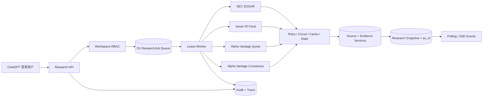

# AlphaLens Beta：运行链路、数据治理与上线手册

> 当前为独立开源项目的实验性 `0.5.0-beta`，不是已通过安全审计的生产服务。本文描述运行配置和机制，不能替代端到端验收。先读[开发边界](DEVELOPMENT.md)、[已知缺口](CAPABILITIES_AND_ROADMAP.md)与[安全政策](../SECURITY.md)。现有部署访问权限保持不变；不要复用原项目的 hosting 标识作为自己的部署配置。
>
> 研究 runner 目前收集快照而非生成论点；平台仲裁/质量评分是启发式实现。Workflow 的审批恢复、发布节点、并发限制与失败终态仍需完善，Webhook Outbox 中断恢复和出站请求防护也需加固。本仓库现有 loopback-only fixture 身份和本地 D1 开发路径，但没有可直接替换为普通公网 Node 服务的独立生产认证方案。A3.2 已交付请求级 Workspace RBAC（`requireWorkspaceAccess` / `requirePortfolioAccess` / `listAccessibleWorkspaces` 统一 401/403/404，跨租户资源 ID 返回与缺失相同的 404，成员管理 API 写脱敏审计），以及双租户 HTTP 集成测试；A3.3 队列失败恢复、删除实际执行与生产认证尚未完成。

## 1. Beta 运行链路



创建任务写入 D1 后立即返回 `202`，并通过 Cloudflare `waitUntil` 启动后台消费者。内部 Worker 通过条件更新获取 90 秒租约，执行时增加 `attempts`；Worker 丢失或超过后台执行窗口后，受保护的恢复 Worker 会回收租约。任务支持指数退避、三次尝试、十分钟超时、取消标记、轮询和 SSE 增量事件。

P1 工作台复用相同租户与任务基础设施。财报 Preview / Deep Dive 创建 ResearchJob；催化剂订阅由 `workbench-worker` 按 `next_refresh_at` 拉取官方 IR；提醒先进入幂等 Outbox，再由邮件、企业微信或微信公众号 Adapter 投递。连接器目标使用 AES-GCM 加密保存，列表接口只返回脱敏提示。

P2 组合层继续复用 Workspace RBAC 与审计。持仓、风险政策、收益率、相关性快照、情景版本/结果、风险快照和行动条件全部按 `workspace_id + portfolio_id` 隔离。组合分析是同步、确定性的纯计算，不调用外部交易系统；`risk.refresh` 按输入哈希去重快照并保存触发条件。

P3 平台层在同一队列上增加实验性 WorkflowRun/StepRun 编排，角色节点仍执行来源快照任务。启发式仲裁结果、候选评分与少数意见可以持久化；研究发布 API 有评论和角色审批门禁，事件进入 Webhook Outbox。`platform-worker` 推进任务与投递，但审批恢复、发布节点、并发上限和部分失败终态尚需完善，不能把此实现视为完整的自主多 Agent 工作流。

## 2. 数据来源与授权边界

| 数据 | 实现 | Beta 边界 | 默认新鲜度 |
|---|---|---|---:|
| SEC 申报与 XBRL | `data.sec.gov` submissions/companyfacts | 公开信息；必须引用 SEC；不得暗示 SEC 背书 | 6 小时 |
| 公司 IR | 证券记录中显式配置的 HTTPS RSS/Atom | 只允许与已批准 IR Base URL 同域；保存链接和必要摘录 | 6 小时 |
| 行情 | Alpha Vantage `GLOBAL_QUOTE` | BYO 合法授权；服务端展示；禁止原始数据再分发 | 15 分钟 |
| 一致预期 | Alpha Vantage `EARNINGS_ESTIMATES` | BYO 合法授权；明确标为 `EXPECTATION`，不得当作公司事实 | 12 小时 |

本项目实现上同时要求 `ALPHA_VANTAGE_API_KEY` 和 `ALPHA_VANTAGE_LICENSE_ACK=commercial-or-authorized`；缺少配置时 Provider 保持 `disabled`。该确认标记不是授权合同：请在接入时自行核对下列官方条款及自己的协议，确认研究、展示、缓存和再分发等具体用途。实时/延时行情也可能受交易所权利约束，不能因为 API 技术上可调用就假设拥有使用权。

依据：

- [SEC EDGAR 限速公告](https://www.sec.gov/filergroup/announcements-old/new-rate-control-limits)
- [SEC Internet Security Policy](https://www.sec.gov/about/privacy-information)
- [Alpha Vantage API 文档](https://www.alphavantage.co/documentation/)
- [Alpha Vantage Terms of Service](https://www.alphavantage.co/terms_of_service/)

## 3. 弹性策略

所有来源都具有缓存、超时、最多三次请求、指数退避、连续五次失败熔断、十五分钟半开窗口和 stale-if-error。Provider 返回统一 envelope：`fetchedAt`、`asOf`、`staleAt`、`freshness`、`cache`、`licenseScope`、脱敏后的 `sourceUrl`。

SEC 在单 Worker 内限制为每 125ms 一次（8 req/s，低于公开的 10 req/s 上限）并优先读缓存。多区域高并发商业部署必须增加单一出口或全局速率协调器，不能把单实例限速误认为全局限速。

## 4. 身份、租户与最小权限

- 登录使用 Sites 调度层管理的 Sign in with ChatGPT；应用不保存密码。
- API 从可信转发头读取用户，按规范化邮箱生成稳定用户 ID。
- 每条业务记录都带 `workspace_id`；所有读写先查 `workspace_members`。
- `viewer` 可读取，`editor` 可创建/取消研究，`owner` 可请求账户删除。
- `0004_military_nemesis.sql` 在 D1 层拒绝非法成员角色、把 owner 转给非成员，以及核心 ResearchJob/Evidence/Thesis/Catalyst/Review/ModelCall 与 Portfolio 记录的跨 Workspace 引用；这是一层纵深防御，不能替代每条 API 的授权查询。
- IR 连接器只访问证券记录中批准的同域 HTTPS 地址；SEC 只访问固定官方端点；行情 Key 只在服务端环境变量中存在。
- 审计日志保存动作、资源、request ID、时间和散列后的 IP，不保存原始 IP；写入前会剔除 token、cookie、API key、credential、prompt、raw body/content 等高风险 metadata，并限制嵌套深度、数量和字符串长度。
- 删除接口先创建可审计请求；后台数据保留策略执行级联删除。生产上线前应明确法定保留例外和 SLA。

## 5. 数据模型与版本规则

基础迁移位于 `drizzle/0000_pretty_squadron_sinister.sql`，P1/P2 增量迁移分别位于 `0001`/`0002`，P3 增量迁移位于 `drizzle/0003_funny_ares.sql`，共 59 张表。`0004_military_nemesis.sql` 增加审计查询索引与核心 Workspace 关系完整性触发器，不新增领域表。P3 新增 Workflow/Step Run、KPI Model、Provider Route、Research Skill/Installation、Arbitration、Artifact Version、Comment/Approval、Benchmark/Evaluation、API Client 和 Webhook Outbox 模型。

- 稳定 ID：自然键经命名空间 SHA-256 生成，不依赖数据库自增值。
- Evidence/Thesis：`logical_id + version` 唯一，新版本记录 `supersedes_id`。
- Source/Evidence 去重：Workspace 范围内的内容哈希唯一。
- ResearchJob 去重：Workspace 范围内的 `idempotency_key` 唯一。
- 浏览器幂等头：对 ticker、问题和 `as_of` 日期的规范化 JSON 做 SHA-256，只发送 ASCII 摘要；Unicode 原文留在 JSON body，禁止直接拼入 HTTP Header。
- 每个 Job 固化 `as_of`、model version、prompt version、trace ID 和最终 snapshot。
- ThesisFalsifier 与 Thesis 分别通过 `logical_id + version` 保留不可变时间线。
- EarningsWorkflow 使用 Workspace 范围幂等键关联 ResearchJob，避免重复创建同一财报研究。
- NotificationOutbox 使用 `channel_id + event_key` 去重，并最多重试五次。
- Peer 指标必须保存 `metrics_as_of`；缺少来源或时间的快照在 UI/导出中明确标记。
- Position 保留 `price_as_of`、`data_status`、币种、ADV 与因子/事件输入；默认标记为 `user_input`，不得冒充实时行情。
- Scenario 通过 `logical_id + version + supersedes_id` 保留版本；Result 和 RiskSnapshot 通过输入哈希幂等。
- ActionCondition 只保存谓词、严重度、说明和人工确认状态；没有订单或执行字段。
- Workflow/KPI/Skill/Artifact 使用稳定逻辑 ID 与不可变版本；每个 Run 固化版本、`as_of` 和 trace。
- API Client 只保存 Key prefix 与 SHA-256 hash；明文只在创建响应出现一次。
- Webhook Subscription 使用 AES-GCM 保存签名密钥；Delivery 按 subscription + event 幂等并最多尝试八次。

## 6. 运维配置

### 6.0 本地 fixture profile（开发专用）

本地复现不使用以上真实凭据。复制 `.dev.vars.example` 为未提交的 `.dev.vars`，运行 `pnpm db:local:migrate` 后使用 `pnpm dev:local` 或 `pnpm local:verify:e2e`。Fixture profile 必须由双显式开关、loopback 来源和 `.invalid` 邮箱同时满足；它生成合成来源并标记 `sourceMode: fixture`。不允许在部署、Tunnel 或公网绑定中使用。完整步骤见[本地 Fixture 工作流](LOCAL_FIXTURE_WORKFLOW.md)。

必需环境变量：

```bash
SEC_USER_AGENT="AlphaLens/0.5 monitored@example.com"
IR_USER_AGENT="AlphaLens/0.5 monitored@example.com"
WORKER_SHARED_SECRET="a-long-random-secret"
CONNECTOR_ENCRYPTION_KEY="at-least-16-random-characters"
```

可选、仅在已获授权时启用：

```bash
ALPHA_VANTAGE_API_KEY="..."
ALPHA_VANTAGE_LICENSE_ACK="commercial-or-authorized"
RESEND_API_KEY="..."
RESEND_FROM_EMAIL="research@verified-domain.example"
WECHAT_OFFICIAL_SEND_URL="https://approved-provider.example/send"
WECHAT_OFFICIAL_ACCESS_TOKEN="..."
```

生产恢复调度器建议每 15–30 秒调用（正常任务不依赖它启动，它负责失败恢复和积压清理）：

```http
POST /api/internal/research-worker
Authorization: Bearer <WORKER_SHARED_SECRET>
```

P1 催化剂刷新、财报状态同步和消息 Outbox 建议每 1–5 分钟调用：

```http
POST /api/internal/workbench-worker
Authorization: Bearer <WORKER_SHARED_SECRET>
```

P3 Workflow 推进与 Webhook Outbox 建议每 15–30 秒调用：

```http
POST /api/internal/platform-worker
Authorization: Bearer <WORKER_SHARED_SECRET>
```

邮件经 Resend REST API 发送并使用 `Idempotency-Key`；默认限流下必须保留队列。企业微信仅接受 `https://qyapi.weixin.qq.com/...` 官方机器人 Webhook。微信公众号只有在获得用户订阅/授权并配置官方账号或获准服务商后才启用；普通个人微信不支持未经授权的主动私信。

主要 API：

```text
POST   /api/v1/research
GET    /api/v1/research/:jobId
DELETE /api/v1/research/:jobId
GET    /api/v1/research/:jobId/events
GET    /api/v1/providers/health
POST   /api/v1/account/delete
GET    /api/health
GET    /api/v1/workbench?ticker=NVDA
POST   /api/v1/workbench
POST   /api/v1/implied-expectations
GET    /api/v1/reports/:ticker?format=markdown|pdf|xlsx
GET    /api/v1/portfolio?portfolioId=...
POST   /api/v1/portfolio
GET    /api/v1/platform
POST   /api/v1/platform
GET    /api/v1/platform/runs/:runId
POST   /api/open/v1/research
GET    /api/open/v1/runs/:runId
GET    /api/open/v1/artifacts/:versionId
```

## 7. 质量门禁

`tests/quality.test.ts` 覆盖财务数字双来源 Tie-out、来源冲突、DCF 金样、`as_of` 时间穿越和置信度校准；`tests/provider-contract.test.ts` 覆盖 Provider 契约、缓存和 stale fallback；`tests/workbench.test.ts` 覆盖两套隐含预期反推、偏差聚合以及 Markdown/PDF/XLSX 文件签名；`tests/portfolio.test.ts` 覆盖组合风险与“无订单字段”约束；`tests/platform.test.ts` 覆盖 DAG 循环、Skill 权限、Provider 路由、仲裁解释、时间泄漏硬门禁和 Webhook SSRF；`tests/fixtures/regression-universe.json` 包含科技、银行、能源、REIT 和生物制药样本。

上述是合成输入与纯函数级检查，不是完整财务模型回归、真实语料校准、历史 Provider 检索验证或安全审计；样本清单不等于每个行业已经跑通研究。PDF/XLSX 文件签名检查也不能代替页面渲染及内容人工抽检。CI 另外执行 lint 和类型检查，不需要生产密钥。

发布门禁：类型检查、单元测试、正式构建、渲染测试全部通过。真实数据上线还必须跑在线 Provider smoke test，并由人工抽检 SEC 原文、期间、单位、币种、拆股口径和一致预期时间戳。

依赖安装采用 pnpm 供应链策略；`pnpm-workspace.yaml` 只允许 `esbuild`、`sharp`、`unrs-resolver` 和 `workerd` 执行安装脚本。这些是当前构建/运行链所需的原生工具，新增需要安装脚本的依赖必须经过人工审查并显式加入 `allowBuilds`，不能在 CI 中关闭该门禁。

## 8. 已知 Beta 边界

- 当前研究 runner 只收集 Provider 快照，尚未接入外部 LLM 或生成论点；模型/Prompt/trace 字段已固化，接入模型时必须逐调用写 `model_calls`。
- IR 解析支持 RSS/Atom；复杂 JavaScript IR 网站需要单独获得允许的抓取或官方 feed。
- 数据删除采用请求式流程，实际 purge 需要受控后台作业与保留策略。
- 无 Alpha Vantage 商业/授权协议时，行情和一致预期会明确降级，不用演示数据冒充实时数据。
- 邮件、企业微信和微信公众号只有在配置真实凭据后才投递；当前部署若缺少配置会显示明确状态并保留失败 Outbox。
- 官方 IR Feed 地址需要在 Security 记录中显式配置；缺失时催化剂刷新返回 `degraded`，不抓取未批准的聚合站。
- 当前 PDF 使用 PDF 标准 CJK 字体映射以保持 Worker 端轻量生成；对归档级 PDF/A 或品牌字体有要求时应改为嵌入授权字体的渲染服务。
- P2 尚未接券商账户、商业因子模型或授权组合数据；价格、因子、ADV 和收益率必须由用户或授权 Provider 提供。相关性是历史 Pearson 描述统计，不等于危机期相关性保证。
- P3 默认含三个行业 KPI 模板和三个内置 Research Skill，不代表全行业口径已完成；新增模板必须经过定义、单位、期间和回归样本评审。
- Open API 尚需部署侧全局/分布式速率限制、密钥轮换 SLA 和异常用量告警；应用层已具备 scope、撤销、过期和审计。
- Webhook 有基础 URL 检查，但 IPv6、DNS 解析/重绑定及发送中断恢复需要补齐；部署时限制出口并验证实际连接 IP，不能依赖当前检查作为完整防护。
- 本系统不下单，不构成投资建议。

## 9. 常见故障

### `String contains non ISO-8859-1 code point`

这表示浏览器尝试把中文等 Unicode 字符直接写入 HTTP Header。AlphaLens 的研究问题应放在 UTF-8 JSON body；`Idempotency-Key` 必须使用 `research-v1-<sha256>` ASCII 摘要。`tests/idempotency.test.ts` 对中文问题、确定性和冲突隔离做回归验证。
