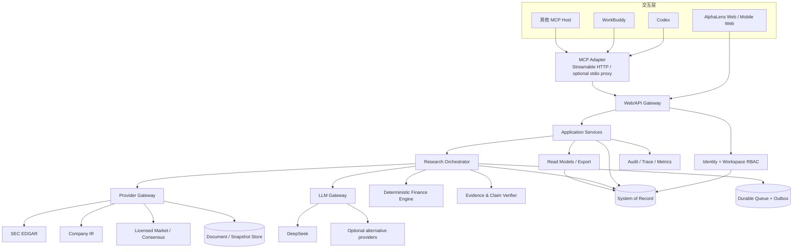

# AlphaLens 独立平台：产品、LLM、Agent 与 MCP 完整方案

> 状态：规划文档，不代表已经实现
>
> 基线：`0.5.0-beta` 现有代码与数据模型
>
> 更新时间：2026-09-18
>
> 目标：把“有很多界面的比赛原型”收敛成可真实使用、可验证、可扩展的个人美股研究平台；再通过 MCP 接入 WorkBuddy、Codex 等 Agent Host。

## 0. 结论先行

推荐采用以下产品与技术决策：

1. **AlphaLens 独立平台是核心产品和唯一事实来源**。Web、API、研究任务、证据、论点、组合和审计都属于平台本身，不能依赖某一个 Agent 客户端才能运行。
2. **DeepSeek 是首个 LLM Provider，不是写死的基础设施**。通过 `LLM Gateway` 接入，后续可以添加其他 OpenAI-compatible Provider、本地模型或企业模型，不改研究领域逻辑。
3. **使用 BYOK（Bring Your Own Key）**。每个用户或 Workspace 在设置页配置自己的模型凭据；浏览器不能保存或读取明文，仓库、日志、任务快照和 MCP 配置都不能出现密钥。
4. **MCP 是受控的外部适配层，不是内部工作流引擎**。Codex/WorkBuddy 调 MCP Tool，MCP 再调用 AlphaLens 的应用服务；所有业务规则、租户隔离和审计仍由 AlphaLens 执行。
5. **先做单一可恢复工作流，再做“多 Agent”**。第一阶段使用一个确定性 orchestrator 加若干清晰的 LLM 分析节点，先验证引用准确率、数字 tie-out 和论点质量；没有评估数据前，不把同一模型换几个角色称作生产级多 Agent。
6. **计算与生成分离**。财务归一化、估值、敏感性、暴露和压力测试由确定性代码计算；LLM 负责提取、解释、提出反证与综合，不负责偷偷计算核心财务数字。
7. **不自动下单**。系统输出证据、论点、证伪条件、风险状态和需要人工确认的行动条件，不保存或发送券商订单。

## 1. 当前项目与目标产品的差距

### 1.1 当前已经有的基础

- React/TypeScript 界面和研究台、个人工作台、组合、平台控制面页面；
- D1 领域表、迁移、Workspace RBAC、审计、研究任务和事件；
- SEC、Issuer IR、Alpha Vantage Provider 适配器；
- 观察池、论点版本、证伪条件、导出、组合确定性计算；
- Workflow、KPI、Skill、审批、Webhook 等实验性控制面；
- 23 项单元测试、生产构建和 SSR 回归检查。

### 1.2 真正阻止用户使用的问题

| 问题 | 用户感受 | 目标状态 |
| --- | --- | --- |
| 首页与研究卡主要是示例 | 点击后看不到真实研究产物 | UI 只渲染实际 snapshot/artifact；示例必须有明显标签 |
| runner 只抓数据 | “深度研究”没有完整报告 | 证据 → 提取 → 正反论点 → 估值 → 证伪 → 审核形成版本化产物 |
| 没有真实 LLM 调用 | Agent 页面只是结构 | LLM Gateway、Prompt/Model 版本、成本、调用追踪和结构化输出全部落库 |
| 身份依赖原托管平台 | 新用户难以本地运行 | 独立认证边界和可重复的本地 fixture 开发路径（本地 fixture 路径已实现；非生产多用户认证仍待实现） |
| P3 生命周期不完整 | Workflow 可能卡在中间状态 | 审批恢复、取消、超时、发布、失败终态均可测试 |
| MCP/Skill 未形成产品接口 | 每个 Agent 接法不同 | 一个远程 MCP Server + 可选 Host 专用 Skill/说明包 |
| 过早铺开大量功能 | 功能多但可信闭环弱 | 优先完成单公司研究闭环，再扩展组合和 Marketplace |

## 2. 目标用户与核心产品闭环

### 2.1 第一目标用户

有一定财务知识、研究美股但缺少机构工具的个人投资者。第一版本不面向投顾代客服务，也不处理客户交易指令。

### 2.2 核心任务

用户不是问“该不该买”，而是完成以下闭环：

```text
研究问题
  → 建立截至 as_of 的数据快照
  → 区分事实 / 市场预期 / 模型推断 / 用户观点 / 未核实信息
  → 形成支持与反对证据
  → 明确市场当前隐含预期
  → 形成可证伪的论点和情景估值
  → 人工审核并发布研究版本
  → 监控催化剂和证伪条件
  → 事件后复盘，更新而不覆盖历史
```

### 2.3 首个真正可用的用户旅程

1. 用户注册并创建私人 Workspace。
2. 在 Settings 配置 SEC 联系信息、获授权的数据源和自己的 DeepSeek Key。
3. 添加股票并提出一个具体问题，例如“NVDA 数据中心增长是否已被充分计价”。
4. 平台先冻结 `as_of`，再收集 SEC/IR/行情/预期快照。
5. 平台显示数据源状态和缺口；没有价格或预期时允许继续做有限研究，但不伪造数值。
6. LLM 在受控 schema 下完成文件提取、论点候选和反方审查。
7. 确定性引擎完成财务 tie-out、隐含预期反推与 Bull/Base/Bear。
8. 验证器检查每条主张的引用、数字、时间和来源冲突。
9. 用户编辑假设和证伪条件，发布 `ResearchArtifact v1`。
10. 催化剂到期或新财报出现时，系统创建增量研究并展示“哪些事实、假设和结论发生了变化”。

## 3. 总体架构



### 3.1 分层职责

| 层 | 负责 | 不负责 |
| --- | --- | --- |
| Web | 配置、状态、编辑、审核、报告展示 | 不持有 Provider Key；不直接调用 DeepSeek/SEC |
| API/Application | 身份、租户、业务命令、幂等、权限 | 不把 HTTP Route 写成研究逻辑 |
| Research Orchestrator | 有限状态机、步骤依赖、恢复、预算 | 不靠 LLM 自己决定持久化状态 |
| Provider Gateway | 授权边界、限速、缓存、新鲜度、来源快照 | 不输出投资结论 |
| LLM Gateway | 模型选择、结构化调用、重试、成本与追踪 | 不拥有论点/组合领域数据 |
| Finance Engine | 归一化、估值、压力测试、约束校验 | 不生成无来源的输入 |
| Evidence Verifier | 引用、数字、时间、冲突与覆盖率 | 不把评分解释成收益概率 |
| MCP Adapter | 标准化 Agent 入口、OAuth、scope、tool schema | 不绕过 AlphaLens API/RBAC；不配置 LLM 密钥 |

## 4. DeepSeek 与可配置 LLM Gateway

### 4.1 Provider 策略

DeepSeek 官方 API 提供 OpenAI-compatible 接口，当前文档给出的 base URL 是 `https://api.deepseek.com`，并列出 `deepseek-flash` 与 `deepseek-v4-pro`。这些名称和能力可能变化，因此模型 ID 必须是配置数据，而不是散落在代码中的常量。官方文档还提供 Responses API、function tools 和 JSON/JSON Schema 输出；平台仍必须验证参数与返回值，因为模型可能产生不符合 tool schema 的参数。[DeepSeek Quick Start](https://api-docs.deepseek.com/) · [Responses API](https://api-docs.deepseek.com/api/create-response/) · [JSON Output](https://api-docs.deepseek.com/guides/json_mode/)

推荐默认策略：

| 任务 | 默认档位 | 说明 |
| --- | --- | --- |
| 文档分类、短摘要、字段提取 | `fast` profile | 低成本、严格 schema、允许小规模重试 |
| 财报差异、反方审查、综合 | `reasoning` profile | 更高预算；必须保留引用，不允许直接成为最终事实 |
| 数字计算 | 不使用 LLM | 交给 Finance Engine |
| 引用核验 | 规则优先，LLM 辅助 | 原文定位、数值和期间由确定性检查负责 |

`fast` 和 `reasoning` 是 AlphaLens 的逻辑 Profile，不绑定某个永久模型名。Workspace Owner 可以映射到获准模型。

### 4.2 BYOK 配置流程

```text
Settings 页面
  → 用户选择 Provider / Base URL / Model Profile
  → 浏览器通过 TLS 一次性提交 API Key
  → Credential Service 加密并保存
  → 明文立即从进程变量和请求对象释放
  → 返回 credential_id、last4、状态，不返回密钥
  → 用户主动点击“测试连接”
  → 服务端做最小请求并显示成功、权限、余额/限流错误或网络错误
```

配置界面需要支持：新增、测试、启用/停用、设置默认 Profile、轮换、删除、查看最后验证时间和最后错误。**不提供“查看原 Key”功能**；遗忘后只能替换。

### 4.3 凭据数据模型

| 实体 | 关键字段 | 安全要求 |
| --- | --- | --- |
| `LlmProvider` | provider type、base URL、能力、允许模型 | 系统配置；自定义 URL 默认关闭，防 SSRF |
| `LlmCredential` | workspace、provider、ciphertext、key version、last4、status | 不保存明文；Workspace Owner 才能管理 |
| `LlmProfile` | fast/reasoning、model ID、limits、credential ref | 版本化；不能跨 Workspace 引用 |
| `PromptVersion` | task type、schema version、prompt hash、内容 | 不可变发布；区分 draft/published |
| `ModelCall` | job/step、provider/model、prompt version、token、latency、status | 请求/响应做脱敏或内容寻址；不得含密钥 |
| `LlmBudget` | per-job/per-day token 与费用上限 | 超限进入 `budget_exceeded`，不能静默继续扣费 |

### 4.4 加密与密钥边界

- 使用 envelope encryption：每个 Workspace 的数据加密密钥（DEK）加密 Provider Key；主密钥（KEK）位于托管 Secret/KMS，不在 D1/Postgres、仓库或环境模板中。
- 密文、nonce、算法、KEK version 和 last4 分开保存；AEAD 的 associated data 包含 `workspace_id + credential_id + provider`，防止密文被换到其他租户。
- 解密只发生在 LLM Gateway 的单次调用范围，不能进入队列 payload、trace、异常、analytics 或 Prompt。
- Owner 操作要二次确认并写审计；成员默认只能看到 Provider 是否可用。
- 公共 Demo 不使用个人的 DeepSeek Key。它只能用 mock/fixture、用户自己的 OAuth/BYOK，或另设有严格限额的项目赞助凭据。
- 已经出现在聊天、Issue、日志或提交中的 Key 一律视为泄露：撤销并创建新 Key，不能只靠“以后不写进代码”。

### 4.5 可靠性不是“换成 DeepSeek 就一直运行”

任何外部 API 都可能限流、余额不足、区域不可用或改变模型。系统应提供：

- Provider 连接健康状态：`healthy / degraded / disabled / invalid_credential / rate_limited`；
- 有界超时、指数退避、抖动、熔断和明确的可重试错误分类；
- 同一调用使用 idempotency/call fingerprint，失败恢复不重复计费；
- 用户明确配置的 fallback Profile；未经许可不能自动改用另一个收费 Provider；
- LLM 不可用时，研究任务进入 `needs_model` 或生成“仅数据快照”产物，而不是整个平台宕机；
- 保存 `prompt_cache_hit_tokens` 和 `prompt_cache_miss_tokens`。DeepSeek 的上下文缓存默认开启但属于 best-effort，不能作为可靠性保证。[DeepSeek Context Caching](https://api-docs.deepseek.com/guides/kv_cache/)

### 4.6 结构化输出策略

每个 LLM 节点必须声明输入 schema、输出 JSON Schema、允许引用的 `evidence_id` 集合、最大 token、最大工具轮次和失败策略。返回后依次执行：

1. JSON/schema 校验；
2. evidence ID 是否真实存在且属于相同 Workspace/Job；
3. 引文能否在已保存来源中定位；
4. 数字、单位、币种、期间与 source span tie-out；
5. 是否引用了 `as_of` 之后的材料；
6. 不通过则修复一次；仍失败进入人工审核，不无限重试。

## 5. 研究工作流：从快照到可发布产物

### 5.1 推荐状态机

```text
DRAFT
  → PLANNED
  → COLLECTING
  → NORMALIZING
  → ANALYZING
  → CALCULATING
  → VERIFYING
  → NEEDS_REVIEW
  → PUBLISHED

任意运行状态 → CANCELLING → CANCELLED
可重试错误 → RETRY_WAIT → 原步骤
不可恢复错误 → FAILED
数据/凭据缺失 → NEEDS_INPUT
```

每个状态只能由 orchestrator 的原子 transition 改变，并记录 `from/to/reason/actor/trace_id/timestamp`。LLM 输出不能直接更新任务状态、论点或组合。

### 5.2 研究步骤

| 步骤 | 输入 | 输出 | Gate |
| --- | --- | --- | --- |
| Plan | ticker、问题、as_of、workflow version | source plan、task plan、预算 | ticker/CIK 映射和 Workspace 权限 |
| Collect | source plan | immutable source snapshots | 许可、域名、限速、新鲜度 |
| Normalize | raw docs/data | facts、periods、units、source spans | schema、duplicate、period check |
| Analyze | evidence set + prompt version | supporting/contradicting claims | 引用集合与 structured output |
| Calculate | normalized inputs | implied expectations、scenarios、sensitivities | 公式版本和输入完整度 |
| Challenge | claims、calculations | counter-evidence、falsifiers、unknowns | 不得删除少数意见 |
| Verify | all candidate artifacts | issue list、confidence components | 引用/数字/时间 gate |
| Review | verified draft | user edits、approval | 人工确认关键假设和证伪条件 |
| Publish | approved draft | immutable artifact version | 完整审计、无阻塞 issue |

### 5.3 投资研究产物 schema

`ResearchArtifact` 至少包含：

- identity：ticker、issuer、exchange、security ID、artifact/version；
- time：`as_of`、source coverage cutoff、generated/published time；
- question：用户研究问题与约束；
- evidence summary：来源覆盖、fresh/stale/missing/conflict；
- facts 与 expectations：严格分区；
- thesis：核心判断、variant perception、支持/反对证据；
- market-implied expectations：价格、公式、输入和求解结果；
- scenarios：Bear/Base/Bull 假设、估值与敏感性；
- falsifiers：指标、阈值、连续期间、下一检查时间；
- catalysts：confirmed/inferred、日期窗口、预期影响；
- risks/unknowns：无法核实的关键缺口；
- review：人工编辑、批准人、Prompt/Model/Formula 版本；
- disclaimer：研究用途、不构成投资建议、不自动交易。

### 5.4 置信度的正确表达

不要显示一个模糊的“92/100 投资可信度”。建议拆成可解释组件：

- source coverage；
- primary-source ratio；
- citation validity；
- numerical tie-out；
- freshness；
- contradiction coverage；
- unresolved conflicts；
- human review status。

这些分数代表研究过程质量，不代表股价上涨概率或收益率。

## 6. Agent 设计

### 6.1 第一阶段：受控流水线，不宣传多 Agent

推荐四类 LLM Node：

1. **Document Extractor**：只从给定文档提取结构化事实与 source span；
2. **Thesis Analyst**：基于已核验证据形成候选论点；
3. **Risk Challenger**：主动查找反证、替代解释和证伪条件；
4. **Synthesis Editor**：整理成用户可读草稿，不新增未引用事实。

四个节点可以暂时使用同一个 DeepSeek Profile，但要有独立 Prompt 版本、输入范围和输出 schema。输出要相互可比较，不能共享隐藏 scratchpad 作为事实。

### 6.2 何时才升级为真实多 Agent

满足以下条件后再并行运行角色：

- 有至少 30–50 个合法、可回放的公司/财报研究 fixture；
- 单流水线的引用准确率、数字 tie-out、任务成功率和人工修改率已有基线；
- 并行角色对同一证据的增量质量大于成本与延迟；
- 仲裁使用可检查 rubric，保留每个候选和少数意见；
- 失败、超时或某角色缺席不会阻止其余结果进入人工审核。

### 6.3 Prompt injection 与文档安全

SEC/IR/网页内容都是不可信数据。模型消息中必须把“平台指令”“用户问题”“检索文档”分区；文档里的“忽略规则、调用工具、泄露密钥”等只能作为文本。LLM Tool allowlist 由任务步骤固定，Provider 文档无权改变。URL 下载、压缩包、HTML、PDF 和附件要有大小、类型、重定向、域名与恶意内容限制。

## 7. 数据架构与持久化

### 7.1 四类数据

| 类型 | 示例 | 推荐存储 |
| --- | --- | --- |
| 事务/权限 | User、Workspace、Credential metadata、Job、Review | D1/Postgres |
| 不可变研究 | SourceSnapshot、EvidenceVersion、ArtifactVersion | D1/Postgres + object store |
| 原始大对象 | filing HTML/PDF、IR 文件、导出 | R2/S3-compatible object store |
| 运行与观测 | events、model calls、traces、usage | 事务库短期 + 日志/分析存储 |

### 7.2 现有 D1 的处理

不立即重写数据库。第一阶段继续使用 D1，把 Repository/Unit-of-Work 接口从 Route 和 Worker 中抽离，并补齐迁移与集成测试。只有出现以下需求时才迁移 Postgres：复杂事务无法可靠表达、高并发任务争用、需要成熟 RLS/分析查询、备份恢复或运营工具。迁移前先用实际指标证明瓶颈。

提供两种部署 Profile：

- **Personal/Beta**：Cloudflare Workers + D1 + R2 + durable queue；成本低、维护简单。
- **Team/Scale**：相同应用接口 + managed Postgres + object storage + durable queue；强调备份、RLS、连接池和高可用。

### 7.3 必须新增或收敛的领域对象

在现有表基础上增加/明确：`LlmProvider`、`LlmCredential`、`LlmProfile`、`LlmBudget`、`PromptVersion`、`ModelCall`、`ResearchPlan`、`StepAttempt`、`SourceSnapshot`、`Claim`、`CitationSpan`、`VerificationIssue`、`FormulaVersion`、`ResearchArtifactVersion`、`ArtifactDiff`。

稳定 ID 与唯一约束：

- Job：`workspace + normalized question + security + as_of + workflow version + input hash`；
- Snapshot：`source + canonical URL + published_at + content hash`；
- Claim：`artifact logical ID + semantic claim key + version`；
- Model call：`job + step + attempt + input hash + profile version`；
- Artifact：逻辑 ID 稳定、版本不可变、`supersedes_id` 显式。

### 7.4 时间正确性

每个值至少区分：`published_at`、`period_end`、`fetched_at`、`available_at`、`as_of`。历史研究只能读取 `available_at <= as_of` 的快照。若 Provider 不支持历史版本，就把结果标为 `current_source_not_point_in_time`，禁止进入无泄漏回测。

## 8. API 与任务执行边界

### 8.1 API 家族（概念设计）

| API | 用途 | 权限 |
| --- | --- | --- |
| `/api/v1/settings/llm-credentials` | 新增、轮换、测试、停用 BYOK | Workspace Owner；从不返回明文 |
| `/api/v1/research-jobs` | 创建/查询/取消研究 | Editor create/cancel，Viewer read |
| `/api/v1/research-jobs/:id/events` | 流式或轮询进度 | 同 Workspace |
| `/api/v1/artifacts` | draft/review/publish/diff/export | 角色与版本 Gate |
| `/api/v1/evidence` | 查询证据与 citation span | 同 Workspace、source policy |
| `/api/v1/portfolio` | 持仓、风险、行动条件 | 同 Workspace；无订单 API |
| `/api/internal/workers/*` | 领取任务、恢复、outbox | 服务身份，不接受用户 token |
| `/mcp` | Agent Host 的 MCP 入口 | OAuth resource server + scopes |

以上是接口边界而非本次实现代码。正式设计时为每个命令建立 OpenAPI/JSON Schema，并确保 Web、MCP 和 Worker 共用 Application Service，而不是复制业务逻辑。

### 8.2 异步与恢复

- Queue message 只传 `job_id/step_id/attempt`，不传原始密钥或完整文档；
- Worker 用原子 lease 和 fencing token，过期 Worker 不能覆盖新结果；
- 每个 StepAttempt 有 timeout、retry policy、next_run_at、error class；
- 取消是协作式：停止新步骤，已发出的外部请求结果不再写入发布产物；
- Outbox 与业务事务同提交，再异步发送通知/Webhook；
- 人工审批是明确的 `WAITING_FOR_REVIEW`，不是“running”；
- 恢复演练覆盖 Worker 崩溃、Provider 429/5xx、余额不足、密钥轮换、重复消息和数据库超时。

## 9. MCP / Agent 插件架构

### 9.1 为什么 MCP 合理

Codex 官方文档显示，Codex 可连接本地 STDIO 或远程 Streamable HTTP MCP Server，支持 Bearer/OAuth、工具 allow/deny list 和按工具审批。WorkBuddy 官方文档也提供用户级/项目级 MCP 配置，并说明可以调用外部工具和服务。因此“一套 AlphaLens MCP Server + 各 Host 的轻量配置/Skill”比为每个平台复制后端更合理。[Codex MCP](https://developers.openai.com/zh-Hans/docs/extend/mcp) · [WorkBuddy MCP](https://www.workbuddy.ai/docs/zh/workbuddy/From-Beginner-to-Expert-Guide/Function-Description/MCP-Guide)

需要明确：MCP 让 Agent **使用 AlphaLens**，不让 AlphaLens 依赖某个 Agent 的模型。旧的 `codex mcp-server` 已移除；Codex 仍作为 Host 连接外部 MCP Server，不能把 Codex App Server 当成通用 MCP Server。[OpenAI migration note](https://developers.openai.com/docs/mcp-server)

### 9.2 推荐拓扑

```text
Codex / WorkBuddy / other host
       │ OAuth + scoped token
       ▼
https://api.alphalens.example/mcp   (Streamable HTTP)
       │
       ▼
MCP Adapter → AlphaLens Application Services → same RBAC/audit/jobs/data

Local development only:
host → stdio thin proxy → remote/local AlphaLens MCP endpoint
```

生产优先使用远程 Streamable HTTP；stdio 仅作为本地开发或不支持远程传输的兼容代理。远程服务使用 OAuth 2.1 发现与 audience/scope 校验，令牌只代表 AlphaLens 用户和 Workspace，不包含 DeepSeek Key。MCP 官方授权模式要求在 HTTP 边界返回正确的 `401` 和 discovery metadata，并验证 token 是发给本 resource server 的。[MCP authorization](https://apps.extensions.modelcontextprotocol.io/api/documents/authorization.html)

### 9.3 MCP 能力设计

第一版只提供少量高价值工具：

| Tool | 性质 | Scope | 审批 |
| --- | --- | --- | --- |
| `alphalens_security_resolve` | read-only | `security:read` | auto |
| `alphalens_research_create` | 创建任务 | `research:write` | prompt |
| `alphalens_research_get` | read-only | `research:read` | auto |
| `alphalens_research_cancel` | 改变状态 | `research:write` | prompt |
| `alphalens_evidence_query` | read-only | `evidence:read` | auto |
| `alphalens_artifact_get` | read-only | `artifact:read` | auto |
| `alphalens_artifact_submit_review` | 改变审核状态 | `artifact:review` | prompt |
| `alphalens_watchlist_add` | 用户数据写入 | `watchlist:write` | prompt |
| `alphalens_portfolio_risk_get` | read-only | `portfolio:read` | auto |

不提供 `configure_llm_key`、任意 SQL、任意 URL 抓取、任意文件读取、发布报告、删除账户或交易下单工具。高风险操作以后按单独 scope 和强制用户确认开放。

Resources 可暴露只读、带租户权限的稳定 URI，例如 `alphalens://research/{job_id}`、`alphalens://artifact/{id}/versions/{v}`、`alphalens://evidence/{id}`。Prompts/Skills 可提供“财报前 Preview”“财报后 Deep Dive”“反方审查”等工作方法，但它们不能替代服务端约束。

### 9.4 长任务兼容策略

研究任务不要占住一次 tool call。`research_create` 快速返回显式 `job_id`、当前状态和下一步；Host 使用 `research_get` 轮询。新版 MCP 已有 Tasks 扩展，但 Host 支持度需做兼容矩阵，因此第一版不把核心可用性绑定到 Tasks；验证通过后再协商启用。当前 MCP 规范还建议有状态操作返回显式 handle，而不是把状态隐藏在传输 session 中。[MCP 2026-07-28 overview](https://blog.modelcontextprotocol.io/posts/2026-07-28/)

### 9.5 Host 包装层

- **Codex**：提供最小 `.codex/config.toml` 示例或安装说明，只包含 MCP URL/OAuth，不包含用户的 DeepSeek Key；用 server instructions 和可选 Skill 说明证据优先、不得下单、写操作需确认。
- **WorkBuddy**：提供项目级 `.workbuddy/mcp.json` 示例与独立 `SKILL.md`，前者负责“怎么连”，后者负责“怎么研究”。先完成兼容测试再宣称支持；官方文档确认其 MCP 配置能力，但实际远程传输、OAuth 回调、tool result 上限和长任务行为需要测试矩阵。
- **其他 Host**：只承诺符合已测试协议版本、transport 和 auth 的组合；不根据配置文件长得相似就宣称兼容。

## 10. 前端产品结构

### 10.1 导航收敛

```text
Research Desk       今日需要复核的论点、数据缺口、催化剂
Companies           公司、研究历史、证据和估值
Research Runs       所有任务、步骤、成本、错误和恢复动作
Portfolio           持仓/观察池、暴露、情景、行动条件
Library             来源、证据、报告与导出
Integrations        数据源、LLM、通知、MCP、API/Webhook
Settings            Workspace、成员、权限、预算、审计、删除
```

实验性的 Platform 页面先放到 `Labs` 或管理员设置，避免普通用户看到大量尚未跑通的控制面。

### 10.2 真实状态语言

所有卡片必须显示以下之一：`sample`、`user_input`、`live`、`delayed`、`stale`、`missing`、`conflicting`、`unverified`。价格、预期、估值与论点分别显示自己的 `as_of`，不能只在页面右上角放一个统一时间。

### 10.3 LLM 设置页

设置页只显示 Provider、Profile、模型、last4、验证时间、健康状态、当日 token/费用、预算和轮换/删除操作。输入 Key 时说明：将发送给哪个 Provider、用于哪些步骤、如何加密、谁可管理、删除后的影响。连接测试失败不得回显完整响应头或 Key。

## 11. 安全、隐私与合规

### 11.1 威胁模型

优先处理：

- 用户把 API Key 放进前端、日志、Git、Prompt 或 MCP 配置；
- 恶意 SEC/IR/网页内容进行 prompt injection；
- MCP Token 跨 Workspace/工具越权；
- 自定义 Base URL、IR Feed 或 Webhook 造成 SSRF/DNS rebinding；
- Job 重放造成重复费用；
- `as_of` 之后的数据污染历史研究；
- Provider 数据被越权缓存或再分发；
- 一个 Workspace 的文档进入另一个 Workspace 的模型上下文；
- 导出报告或日志泄露持仓与个人研究。

### 11.2 控制措施

- 服务端认证、Workspace RLS/过滤和 object key 前缀三层隔离；
- OAuth token 校验 issuer、audience、scope、expiry、subject；
- MCP 读写工具分离，写操作默认 `prompt`；
- Provider endpoint allowlist；自定义 endpoint 仅管理员启用，解析 DNS 后校验每次实际连接 IP；
- egress proxy/WAF、请求体/响应体/文件大小限制；
- Prompt/文档分区、工具 allowlist、结构化 schema；
- trace 自动脱敏，禁止 Authorization/API Key、原始持仓和文档全文进入普通日志；
- 审计 credential create/test/rotate/delete、研究发布、导出和访问敏感组合；
- 删除流程覆盖密文、缓存、对象、模型调用内容和备份保留说明；
- 依赖、镜像、MCP SDK 和 Prompt 版本锁定与升级记录。

### 11.3 数据出境与模型隐私

在让用户启用 DeepSeek 或其他 Provider 前，应明确显示哪些内容会发送给第三方：研究问题、文档摘录、财务数据和可能的用户观点。默认不发送持仓、邮箱、Workspace 成员信息或无关原始文档。具体数据保留、训练使用、区域和合规结论必须以接入时适用的供应商条款和法律审查为准，不能由代码推断。

## 12. 质量评估体系

### 12.1 离线评估集

建立合法可再分发或只在 CI 私有环境使用的样本：

- 10 家公司起步：半导体、SaaS、银行、能源、REIT、生物科技；
- 每家公司至少一个 10-K、两个 10-Q、一个 earnings release；
- 5 个来源冲突案例、5 个时间泄漏案例、5 个单位/币种/拆股案例；
- 人工标注事实、引用 span、关键 KPI、支持/反对证据和期望缺口；
- 单独保留 holdout，不把所有金样写进 Prompt。

### 12.2 指标

| 维度 | 指标 | 初始 Release Gate |
| --- | --- | --- |
| 来源 | 主张引用覆盖率 | 关键事实 100% 有引用 |
| 引用 | citation span 准确率 | 人工样本 ≥ 95% |
| 数字 | 金额/单位/期间 tie-out | 关键数字 100% 或明确冲突 |
| 时间 | future evidence leakage | 0 容忍 |
| 结构 | schema success after one repair | ≥ 99% |
| 稳定 | 同输入重复运行的关键事实一致 | ≥ 99% |
| 人工 | 发布前重大修改率 | 持续下降并分原因统计 |
| 运行 | Job 终态率 | ≥ 99%，无永久 running |
| 成本 | 单研究 token/费用 | 在 Workspace budget 内 |

阈值是首版工程目标，需要用实际样本校准；不能把它们宣传为投资业绩。

### 12.3 在线质量反馈

用户可对“事实错误、引用错误、期间错误、遗漏反证、解释不清、估值假设不合理”分别反馈。每次反馈关联 artifact/model/prompt/source/formula version，用于回归而不是直接训练。生产 Prompt 更新必须经过离线 eval、canary 和可回滚发布。

## 13. 可观测性与服务目标

### 13.1 每次研究必须可回答

- 用了哪些来源，哪些缺失、陈旧或冲突？
- 每一步使用了哪个 workflow/prompt/model/formula version？
- LLM 调用了几次、多少 token、缓存命中多少、花费和延迟多少？
- 哪些结果由确定性计算产生，哪些由模型推断，谁人工修改/批准？
- 失败在哪一步，是否可安全重试，是否产生重复费用？

### 13.2 Beta SLO（待基线验证）

- API 非研究读取成功率 ≥ 99.5%；
- 研究创建 P95 < 1 秒并快速返回 Job ID；
- fixture 研究在目标窗口内到达终态 ≥ 99%；
- 任何 Workspace 数据越权 = 0 容忍；
- 发布 Artifact 的关键引用/数字/时间 Gate 必须通过；
- 外部 Provider 不可用时界面在 1 分钟内显示明确 degraded 状态。

这些是目标而非当前承诺；先埋点测基线，再决定正式 SLA。

## 14. 实施路线图与 Gate

### Phase 0：安全处置与计划冻结（立即）

- 撤销已经暴露的 DeepSeek Key，生成新 Key但不写入仓库或聊天；
- 完成本方案评审，创建 ADR；
- 明确首个部署 Profile、身份方案、数据许可和 LLM 隐私提示；
- 将尚未真实可用的 UI 标为 sample/labs。

**Gate**：仓库历史、日志、Issue、配置和构建产物扫描无密钥；产品边界得到确认。

### Phase 1：真实证据闭环

- Research UI 渲染实际 snapshot/source/warning；**已完成核心 UI：任务结果页展示来源 URL、抓取时间、`as_of`、缓存、新鲜/陈旧、缺失能力和警告；真实 Provider/租户环境验收仍待 A3。**
- 新建 artifact 草稿、引用 span、验证 issue 和 diff；
- fixture-backed 本地数据库和研究任务；**已完成：loopback-only `.invalid` fixture 身份、隔离 D1 迁移、合成 Provider snapshot，以及创建/执行/查询/取消的端到端验证。**
- **A3.1 已完成数据库基础**：owner membership、角色合法性、核心研究/组合关系同 Workspace 约束与审计 metadata 脱敏，均有新鲜 local D1 验收。**A3.2 已完成请求级 RBAC**：`requireWorkspaceAccess` / `requirePortfolioAccess` / `listAccessibleWorkspaces` 统一 401/403/404，跨租户资源 ID 返回与缺失相同的 404；成员管理 API 写脱敏审计；控制性 Owner 原子转移（目标须为已有成员，旧 owner 保留为普通 owner 成员，新 owner 受降级/移除保护）；`tests/tenant-isolation.test.ts` + `tests/workspace-access.test.ts` + `tests/ownership-transfer.test.ts` 双租户越权与 role-matrix 集成测试通过；`x-alphalens-workspace` 仅在 membership 校验后生效。**A3.3 已完成后台可靠性**：可恢复研究任务状态机（原子 lease 领取、有限重试与退避、lease 回收、取消优先、terminal 不可重执行）、at-least-once Webhook/通知 Outbox（防 SSRF URL 校验、dead-letter 与 workspace 隔离）与安全账户删除（确认门、controlling-owner 前置、可取消、后台软删除、删除后禁止再认证）。生产级托管队列、OAuth/SSO、监控告警与合规数据保留审批仍未完成。

**Gate**：用户能从一个真实/fixture 来源任务走到可复核研究草稿；没有 LLM 也能看到完整数据链路。

### Phase 2：DeepSeek BYOK 与单流水线分析

- Settings 凭据生命周期、envelope encryption、预算；
- LLM Gateway + DeepSeek adapter；
- Extract/Thesis/Challenge/Synthesis structured nodes；
- ModelCall、PromptVersion、token/cost、错误分类；
- 引用/数字/时间 Gate 与人工 Review。

**Gate**：任何发布结论都能回到 source span；Key 不出 Credential Service；LLM 故障只降级研究任务。

### Phase 3：工作流可靠性

- 审批恢复、发布节点、并发限制、fencing token、取消；
- Provider fallback 真正执行并记录；
- Outbox 中断恢复、删除作业、灾难恢复演练；
- 质量评估集、Prompt canary 和回滚。

**Gate**：故障注入下无永久 running、无重复发布、无跨租户读取、无静默 Provider 切换收费。

### Phase 4：MCP Beta

- Remote Streamable HTTP MCP + OAuth/scopes；
- 先上线 5–9 个受控 Tool、read-only Resource 和 long-job handle；
- Codex 与 WorkBuddy 兼容矩阵；
- Host 专用安装文档和 Skill 指令；
- tool schema、输出上限、超时、审批和撤销测试。

**Gate**：Host 不能绕过 RBAC；所有写工具可确认可审计；MCP 不暴露 LLM Key；兼容性按实际测试声明。

### Phase 5：组合与团队深化

- 真实 Artifact 与持仓风险联动；
- 团队评论/审批/发布完善；
- 在有评估收益后引入真实并行 Agent；
- Python 分析 Worker 只用于已证明需要的复杂模型，不重写控制面。

**Gate**：每个新能力有样本、指标、权限与回滚；继续保持无自动下单。

## 15. 建议的 ADR（Architecture Decision Records）

1. `ADR-001 Independent Platform First, MCP as Adapter`
2. `ADR-002 BYOK Credential Isolation and Envelope Encryption`
3. `ADR-003 Provider-neutral LLM Gateway with DeepSeek First`
4. `ADR-004 Deterministic Finance Engine vs Generative Analysis`
5. `ADR-005 Evidence/Claim/Citation Version Model`
6. `ADR-006 Durable Research State Machine and Human Review Gate`
7. `ADR-007 D1 Now, Repository Boundary Before Any Postgres Migration`
8. `ADR-008 Remote MCP OAuth and Restricted Tool Surface`
9. `ADR-009 No Brokerage Execution`
10. `ADR-010 Evaluation Required Before Multi-Agent Claims`

每份 ADR 写 Context、Decision、Alternatives、Consequences、Security/Data impact、Revisit trigger，不写成营销文案。

## 16. 明确不做的事

- 不使用已暴露的 Key，也不把个人 Key作为公开 Demo 的公共额度；
- 不在浏览器 LocalStorage、GitHub Secret 以外的普通环境文件、D1 明文字段、Prompt 或 MCP 配置里保存 Key；
- 不为了“后端看起来高级”立刻用 Python/Go/C++ 重写；
- 不把模型输出直接当事实或财务计算结果；
- 不把同一个模型换四个角色就宣传为多 Agent；
- 不把 `as_of` 字段当作历史无泄漏证明；
- 不把 API Key 确认框当作数据授权合同；
- 不开放任意 URL、SQL、文件系统、发布、账户删除或交易工具给 MCP；
- 不让实验性 Workflow/Marketplace 分散真实研究闭环的优先级；
- 不承诺任何外部 LLM“永远在线”或投资结果。

## 17. 完成定义

AlphaLens 可以称为“可用 Beta”，必须同时满足：

1. 新用户按文档可以独立启动 fixture-backed 平台；
2. BYOK Key 全生命周期可配置、测试、轮换、删除且永不回显；
3. 至少一个美股研究从问题走到带真实引用的 Artifact；
4. 事实、预期、推断、用户观点和未知明确分离；
5. 关键数字、引用和 `as_of` 通过自动 Gate 与人工 Review；
6. 失败、取消、重试、恢复和预算耗尽都有真实终态；
7. 首页不把示例冒充实时研究；
8. MCP 通过 OAuth/scopes 访问同一服务，不能绕过 Workspace；
9. Codex/WorkBuddy 支持只按实际兼容测试声明；
10. 没有自动订单对象、券商连接器或下单路径。

## 18. 官方资料与版本注意

- [DeepSeek API Quick Start](https://api-docs.deepseek.com/)
- [DeepSeek Responses API](https://api-docs.deepseek.com/api/create-response/)
- [DeepSeek JSON Output](https://api-docs.deepseek.com/guides/json_mode/)
- [DeepSeek Context Caching](https://api-docs.deepseek.com/guides/kv_cache/)
- [Codex MCP configuration](https://developers.openai.com/zh-Hans/docs/extend/mcp)
- [Codex MCP server removal / App Server distinction](https://developers.openai.com/docs/mcp-server)
- [WorkBuddy MCP guide](https://www.workbuddy.ai/docs/zh/workbuddy/From-Beginner-to-Expert-Guide/Function-Description/MCP-Guide)
- [MCP 2026-07-28 overview](https://blog.modelcontextprotocol.io/posts/2026-07-28/)
- [MCP authorization guidance](https://apps.extensions.modelcontextprotocol.io/api/documents/authorization.html)

模型名、MCP 版本和 Host 支持能力会变化。实现时固定已测试版本，建立兼容矩阵和升级 ADR，不依赖本文中的某个模型名永久有效。
